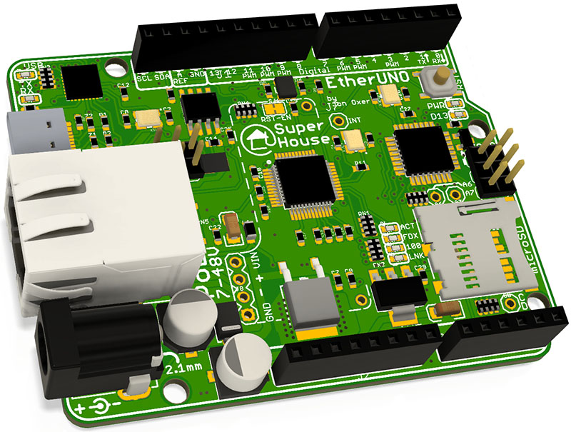

SuperHouse EtherUNO
===================

The EtherUNO is a 100% Arduino Compatible Board, based on the Arduino
UNO reference design, but with improvements and updates for ease of use,
cost, and getting started. It also includes on-board Ethernet with PoE
(Power-over-Ethernet) support and uses a USB-C socket.

Features:

 * LEDs visible on the edge
 * USB-C Connector
 * I2C MAC address ROM
 * Overlay guide where you need it (both top and bottom)
 * D13 pin works for everything
 * RX pin biased
 * Mounting holes

More information is available at:

  https://www.superhouse.tv/eu

Hardware
--------
The "Hardware" directory contains the PCB design as an EAGLE project.
EAGLE PCB design software is available from Autodesk free for
non-commercial use.

Credits
-------
 * Jonathan Oxer <jon@oxer.com.au>

 The EtherUNO is based on the EtherTen, which was designed by Jonathan
 Oxer and Marc Alexander.

License
-------
Copyright 2020 SuperHouse Automation Pty Ltd  www.superhouse.tv  

The hardware portion of this project is licensed under the TAPR Open
Hardware License (www.tapr.org/OHL). The "license" folder within this
repository contains a copy of this license in plain text format.

